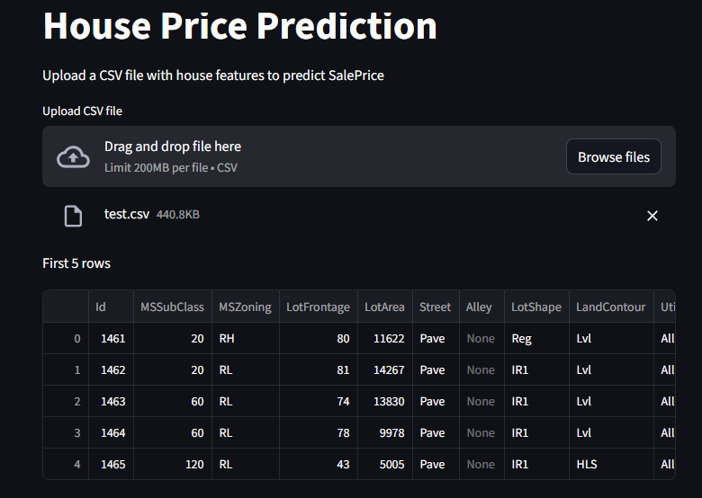
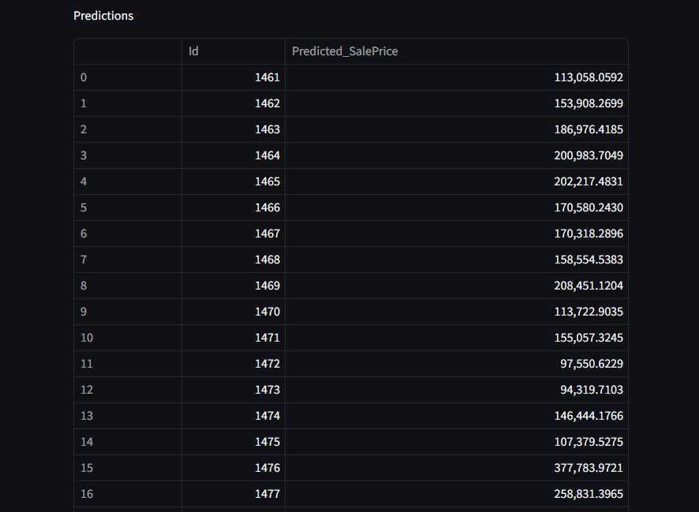

# House Prices Prediction

## Overview
This project predicts house prices using machine learning. Multiple regression models are compared, and the best one is selected based on **RMSE**

Dataset: https://www.kaggle.com/competitions/house-prices-advanced-regression-techniques/data

A **Streamlit interface** allows users to easily upload CSV files for predictions and download a ready-to-submit `submission.csv` for Kaggle.

## Features

### Regression Models Compared
- Random Forest Regressor
- HistGradientBoosting Regressor
- Ridge Regression
- Lasso Regression

### Preprocessing Pipeline
- Handles missing values:  
  - Numeric: mean  
  - Categorical: most frequent
- Feature scaling
- One-hot encoding
- Automatic selection of the best model based on RMSE

## Installation

### Clone the repository
```bash
git clone https://github.com/shmahma/HOUSE_PRICES
cd HOUSE_PRICES
```

### Install dependencies
```bash
pip install -r requirements.txt
```


## Usage

### 1️⃣ Train the Model
```bash
python src/train.py
```
- Trains multiple models
- Selects the best one 
- Saves the pipeline as `model.pkl`

### 2️⃣ Predict with Test Data
```bash
python src/evaluate.py 
```
- Produces predictions and regression evaluation metrics: R², MAE, and RMSE
  
### 3️⃣ Streamlit Interface
```bash
python -m streamlit run app.py
```
- Upload a CSV file with house features
- View predictions in the browser
- Download `submission.csv` ready for Kaggle



